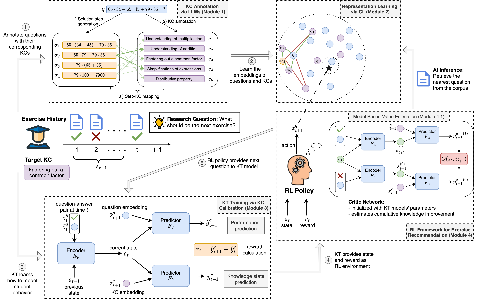

# ExRec – Personalized Exercise Recommendation with Semantically-Grounded Knowledge Tracing

> **TL;DR.** ExRec turns a calibrated Knowledge‑Tracing (KT) model into a fully fledged RL environment and learns exercise‑recommendation policies that *directly optimise students’ knowledge gains*.

<p align="center">
  
</p>

---

## Table of Contents
1. [What is ExRec?](#what-is-ExRec)  
2. [Installation](#installation)  
3. [Module Details](#module-details)  
   * 5.1  [Module 1 – KC Annotation](#module-1--kc-annotation)  
   * 5.2  [Module 2 – Representation Learning](#module-2--representation-learning)  
   * 5.3  [Module 3 – KT Training with KC Calibration](#module-3--kt-training-with-kc-calibration)  
   * 5.4  [Module 4 – RL for Exercise Recommendation](#module-4--rl-for-exercise-recommendation)  
4. [Benchmark Tasks](#benchmark-tasks)  

---

## What is ExRec?
ExRec is a general‑purpose framework for personalising learning materials with minimal supervision.  
It **(i)** annotates questions with Knowledge Concepts (KCs) & solution steps, **(ii)** learns semantic embeddings, **(iii)** trains & calibrates a KT model to output *KC‑level* mastery, and **(iv)** plugs this calibrated model into a variety of **RL algorithms**—including our **Model‑Based Value Estimation (MVE)**—to recommend the next best exercise.

**Key features**

* **Open‑corpus ready** – no need for manual KC labels.  
* **Compact student state & KC‑aware rewards** – designed for efficient RL.  
* **Algorithm‑agnostic** – works with discrete or continuous action spaces, on‑ or off‑policy learners.  
* **Interpretable** – every action corresponds to a real exercise and maps back to target KCs.

---

## Installation
1. **Datasets**  
   * **XES3G5M** – download the original corpus from <https://github.com/ai4ed/XES3G5M> and copy to `data/XES3G5M/`.  
     – We ship *English* question texts, KC annotations & clusters in `data/XES3G5M/metadata/` (no additional cost).  

2. **Python environments**  
We recommend 3 separate python virtual environments for separate modules. 
    * **Modules 1 and 2:** KC Annotation and Representation Learning
    ```bash
   # Install required libraries
   pip install -r requirement_env_rep_learning_.txt
   ```
   * **Module 3:** KT Training with KC Calibration
   ```bash
   # Install required libraries
   pip install -r requirements_env_pykt.txt

   # Install our customized PyKT to be loaded as a module
   cd pykt-toolkit && pip install -e .
   ```
    * **Module 4:** RL Framework for Exercise Recommendation

   ```bash
   # Install required libraries
   pip install -r requirements_env_rl.txt

   # Install our customized PyKT to be loaded as a module
   cd pykt-toolkit && pip install -e .

   # Install our customized exercise_recommender to be loaded as a module
   cd ../exercise_recommender && pip install -e .
   ```

   **Note:** The default version of [Tianshou library](https://tianshou.org/en/stable/) does not provide a an efficient implementation of vectorized environment for environments (such as our calibrated KT model) on GPU. For this, we wrote multiple wrappers (see [exercise_recommender/wrappers](exercise_recommender/wrappers)) and process multiple in environments in batches in GPU. As a result, we support a particular version of Tianshou library as our wrappers may not work with the future updates of the library. 

---

## Module Details
### Module 1 – KC Annotation

This part shows the example use case of our fully automated KC annotation pipeline. First, locate the [kc_annotation](kc_annotation) folder. Then you can follow the steps below. 

```bash
# a) generate solution steps
python get_step_by_step_solutions.py --original_question_file ../data/XES3G5M/metadata/questions_translated.json --annotated_question_file ../data/XES3G5M/metadata/questions_translated_sol_annotated.json

# b) annotate KCs and map steps ↔ KCs (two steps merged for efficiency)
python get_kc_annotations_and_mapping.py --original_question_file ../data/XES3G5M/metadata/questions_translated_kc_annotated.json --annotated_question_file ../data/XES3G5M/metadata/questions_translated_kc_sol_annotated_mapped.json
```

***Skip this step*** if you reuse our pre‑computed file  
`data/XES3G5M/metadata/questions_translated_kc_sol_annotated_mapped.json`.

### Module 2 – Representation Learning

For this part, first locate the [representation_learning](representation_learning) folder. Then you can train the language model as below.

```bash
python train.py --json_file_dataset ../data/XES3G5M/metadata/questions_translated_kc_sol_annotated_mapped.json --json_file_cluster_kc ../data/XES3G5M/metadata/kc_clusters.json --json_file_kc_questions data/XES3G5M/metadata/kc_questions_map.json --wandb_project_name <your_wandb_project_name>
```

Note that the above command requires you to setup your wandb account first.

After training, you can save the embeddings by following [save_embeddings.ipynb](representation_learning/save_embeddings.ipynb).

***Skip this step*** if you reuse our pre‑computed file  
`data/XES3G5M_embeddings/qid2content_sol_avg_emb.json` and `data/XES3G5M_embeddings/kc_emb.json` .

### Module 3 – KT Training with KC Calibration 
As explained in the paper, we first train the KT model with the performance prediction objective.

```bash
cd pykt-toolkit/train_test
python queemb_dkt_train.py --emb_path=data/XES3G5M_embeddings/qid2content_sol_avg_emb.json --flag_load_emb --use_wandb --wandb_project_name=<your_wandb_project_name>
```

Then we calibrate the KT model for running the inference directly on KC embeddings to predict the knowledge states.

```bash
cd pykt-toolkit/train_test
python calibration_train.py --flag_use_cluster --flag_joint_train --flag_lstm_frozen --emb_path=data/XES3G5M_embeddings/qid2content_sol_avg_emb.json  --clusters_to_qids_path=data/XES3G5M/metadata/cluster_to_que_ids_map.json --kc_emb_path=data/XES3G5M_embeddings/kc_emb.json --pretrained_model_path=</path/to/pretrained_model> --kc_to_questions_path=data/XES3G5M/metadata/kc_questions_map.json
```

***Skip this step*** if you reuse our pre‑trained KT model  
`data/pretrained_kt_model.ckpt` .

### Module 4 – RL for Exercise Recommendation
We support multiple back‑ends (via [Tianshou](https://tianshou.org/en/stable/) library) and both **continuous** & **discrete** action agents.

#### Example: Soft Actor‑Critic (SAC) + MVE
```bash
python train_test/current_kc_train_sac.py --critic_model=critic_dkt --tau=0.01 --gamma=0.99 --alpha=0.2 --deterministic_eval --use_wandb --wandb_project_name=current_kc_sac
```

---

## Benchmark Tasks
| Task ID | Description | Reward |
|---------|-------------|--------|
| `global`    | Improve *overall* mastery across all KCs | Δ mean mastery |
| `practiced` | Focus on the KC most recently practised | Δ mastery of the practiced KC |
| `upcoming`  | Anticipate the empirically next KC | Δ mastery of upcoming KC |
| `weakest`   | Always target the student’s weakest KC | Δ mastery of weakest KC |

## How to run each experiment

Below we provide the example scripts for how to run each experiment. Although we provide the examples for one RL algorithm, it can be easily extended to other algorithms by choosing their respective training scripts.

### Task 1: Global Knowledge Improvement

```bash
python train_test/all_kc_train_sac.py --critic_model=critic_dkt --tau=0.01 --gamma=0.99 --alpha=0.2 --deterministic_eval --use_wandb --wandb_project_name=all_kc_sac
```

### Task 2: Knowledge Improvement in Practiced KC

```bash
python train_test/current_kc_train_sac.py --critic_model=critic_dkt --tau=0.01 --gamma=0.99 --alpha=0.2 --deterministic_eval --use_wandb --wandb_project_name=current_kc_sac
```

### Task 3: Task 3: Knowledge Improvement in Upcoming KC

```bash
python train_test/upcoming_kc_train_sac.py --tau=0.01 --gamma=0.99 --alpha=0.2 --deterministic_eval --use_wandb --wandb_project_name=upcoming_kc_sac
```

### Task 4: Task 4: Knowledge Improvement in Weakest KC

```bash
python train_test/worst_kc_train_sac.py --tau=0.01 --gamma=0.99 --alpha=0.2 --deterministic_eval --use_wandb --wandb_project_name=worst_kc_sac
```